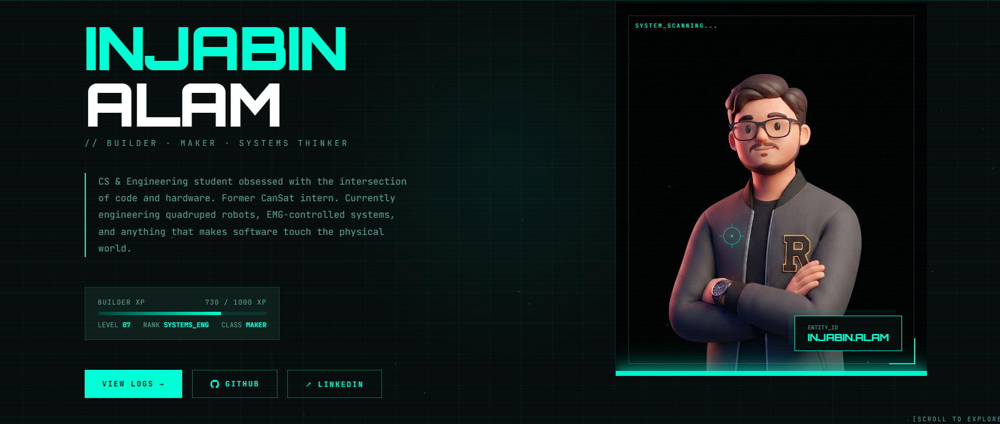

# Hi there, I'm Md. Injabin Alam
### Software Engineering & Robotics Enthusiast | Computer Science @ UIU

  

## TL;DR
I'm an undergraduate Computer Science & Engineering student bridging the gap between high-level software architecture and physical hardware. I am passionate about building robust web applications, intelligent embedded systems, and scalable full-stack solutions. 

- Education: B.Sc. in Computer Science & Engineering, United International University (UIU).
- Focus Areas: Full-Stack Development, Embedded Systems (ESP32/Arduino), and PCB/CAD Design.
- Collaboration: Always open to open-source contributions and hardware-software integration projects.

---

## Technical Arsenal

### Software Development

### Hardware & System Design

### Databases & Workflows

---

## Featured Engineering Projects

### [Nexus Stock AI](fintech-ai-swe-proj-next-js)
A modern fintech web application delivering real-time market data and AI-powered stock analysis. 
- Tech Stack: Next.js, React, TypeScript, Gemini API.
- Impact: Engineered scalable frontend architecture and seamless API integration for responsive financial tracking.

### [NextNest](https://github.com/Ninjabin29/Nextnest)
A streamlined desktop application engineered to optimize property listing and discovery workflows.
- Tech Stack: Java, JavaFX, MySQL.
- Impact: Delivered a robust desktop solution with complex database queries and user-friendly GUI.

### [AquaSweep & Embedded Prototyping](https://github.com/Ninjabin29/aquasweep-dashboard)
Autonomous water analysis rovers and smart detection units.
- Tech Stack: ESP32, C, Fusion 360, Hardware Sensors.
- Impact: Designed system architectures, physical 3D enclosures, and custom PCB layouts for microcontroller-based systems.

### [Jibon Niye Khela](https://github.com/Ninjabin29/jibon-niye-khela)
A dynamic, text-driven life simulation game exploring procedural generation and consequence-based branching logic.

---

## Experience & Leadership

- UIU CanSat Team & VTOL Projects: Contributed to aerospace and drone prototyping, specializing in hardware integration, circuit soldering, and 3D CAD modeling.
- Technical Co-Author: Co-authored the system specification and structural documentation for CareNest, a predictive healthcare resource distribution platform utilizing Hyperledger Fabric.

---

## GitHub Analytics

  
  

  

---

## Connect With Me

  <i>"Coding is like building with LEGOs—once you master the basics, the possibilities are infinite."</i>

